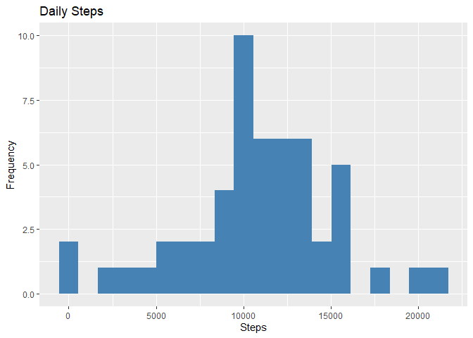

## Instructions
It is now possible to collect a large amount of data about personal movement using activity monitoring devices such as a Fitbit, Nike Fuelband, or Jawbone Up. These type of devices are part of the “quantified self” movement – a group of enthusiasts who take measurements about themselves regularly to improve their health, to find patterns in their behavior, or because they are tech geeks. But these data remain under-utilized both because the raw data are hard to obtain and there is a lack of statistical methods and software for processing and interpreting the data.  

This assignment makes use of data from a personal activity monitoring device. This device collects data at 5 minute intervals through out the day. The data consists of two months of data from an anonymous individual collected during the months of October and November, 2012 and include the number of steps taken in 5 minute intervals each day.

This assignment will be described in multiple parts. You will need to write a report that answers the questions detailed below. Ultimately, you will need to complete the entire assignment in a single R markdown document that can be processed by knitr and be transformed into an HTML file.  
For the plotting aspects of this assignment, feel free to use any plotting system in R (i.e., base, lattice, ggplot2)  
Fork/clone the [GitHub repository created for this assignment](http://github.com/rdpeng/RepData_PeerAssessment1). You will submit this assignment by pushing your completed files into your forked repository on GitHub. The assignment submission will consist of the URL to your GitHub repository and the SHA-1 commit ID for your repository state.  
NOTE: The GitHub repository also contains the dataset for the assignment so you do not have to download the data separately.

## Data
The data for this assignment can be downloaded from [here](https://d396qusza40orc.cloudfront.net/repdata%2Fdata%2Factivity.zip)  
The variables included in this dataset are:  

  - steps: Number of steps taking in a 5-minute interval (missing values are coded as 𝙽𝙰)
  - date: The date on which the measurement was taken in YYYY-MM-DD format
  - interval: Identifier for the 5-minute interval in which measurement was taken  
The dataset is stored in a comma-separated-value (CSV) file and there are a total of 17,568 observations in this dataset.

## Review criteria
1. **Repo**
  - Valid GitHub URL
  - At least one commit beyond the original fork
  - Valid SHA-1
  - SHA-1 corresponds to a specific commit

2. **Commit containing full submission**
  - Code for reading in the dataset and/or processing the data.
  - Histogram of the total number of steps taken each day.
  - Mean and median number of steps taken each day.
  - Time series plot of the average number of steps taken.
  - The 5-minute interval that, on average, contains the maximum number of steps.
  - Code to describe and show a strategy for imputing missing data.
  - Histogram of the total number of steps taken each day after missing values are imputed.
  - Panel plot comparing the average number of steps taken per 5-minute interval across weekdays and weekends.
  - All of the R code needed to reproduce the results (numbers, plots, etc.) in the report.
  
## Preprocessing
## Loading and preprocessing the data
1. First, we set up the environment as we install the following libraries.

```r
library(dplyr)
library(ggplot2)
library(Hmisc)
```

2. Then, we read the dataset.

```r
library("data.table")
```

```
## 
## Attaching package: 'data.table'
```

```
## The following objects are masked from 'package:dplyr':
## 
##     between, first, last
```

```r
activity_data = data.table::fread(input = "repdata_data_activity/activity.csv")
head(activity_data, 10)
```

```
##     steps       date interval
##  1:    NA 2012-10-01        0
##  2:    NA 2012-10-01        5
##  3:    NA 2012-10-01       10
##  4:    NA 2012-10-01       15
##  5:    NA 2012-10-01       20
##  6:    NA 2012-10-01       25
##  7:    NA 2012-10-01       30
##  8:    NA 2012-10-01       35
##  9:    NA 2012-10-01       40
## 10:    NA 2012-10-01       45
```

We notice that there are 2304 missing values in our dataset, hence our calculations of measures of central tendency will be affected.

```r
activity_data[is.na(steps), .N ]
```

```
## [1] 2304
```
## What is mean total number of steps taken per day?

1. Since these are steps recorded between minutes, we will calculate the daily steps by using an apply function for group-by.


```r
total_steps_raw = activity_data[, c(lapply(.SD, sum, na.rm = FALSE)), .SDcols = c("steps"), by = .(date)] 
head(total_steps_raw, 10)
```

```
##           date steps
##  1: 2012-10-01    NA
##  2: 2012-10-02   126
##  3: 2012-10-03 11352
##  4: 2012-10-04 12116
##  5: 2012-10-05 13294
##  6: 2012-10-06 15420
##  7: 2012-10-07 11015
##  8: 2012-10-08    NA
##  9: 2012-10-09 12811
## 10: 2012-10-10  9900
```

2. To understand the frequency of the steps, we create a histogram of 20 bins. 


```r
ggplot(total_steps_raw, aes(x = steps)) +
    geom_histogram(fill = "steelblue", bins=20) +
    labs(title = "Daily Steps", x = "Steps", y = "Frequency")
```

```
## Warning: Removed 8 rows containing non-finite values (stat_bin).
```

 

From the histogram, the distribution is similar to a bell curve, with more frequent points at the 10000 range.

3. Finally, we calculate the mean and median of the daily steps and for that, we include the missing values.

```r
total_steps_raw[, .(mean_steps_raw = mean(steps, na.rm = TRUE), median_steps_raw = median(steps, na.rm = TRUE))]
```

```
##    mean_steps_raw median_steps_raw
## 1:       10766.19            10765
```

From our calculations, the person walks or runs around 11000 steps per day.

## What is the average daily activity pattern?

1. First, we make a time series plot (line)  of five-minute interval and average steps to visualize the trend.


```r
interval_data_raw = activity_data[, c(lapply(.SD, mean, na.rm = TRUE)), .SDcols = c("steps"), by = .(interval)] 
ggplot(interval_data_raw, aes(x = interval , y = steps)) + geom_line(color="steelblue", size=1) + labs(title = "Average Daily Steps", x = "Time Intervals", y = "Average Steps per day")
```


2. Which 5-minute interval, on average across all the days in the dataset, contains the maximum number of steps?


```r
interval_data_raw[steps == max(steps), .(max_interval = interval)]
```

```
##    max_interval
## 1:          835
```

At this interval, we can initially observe that the person's most active hour is around this.

## Imputing missing values

1. One issue with our scores is that we exclude the missing values hence to resolve that, we Calculate and report the total number of missing values in the dataset (i.e. the total number of rows with 𝙽𝙰s)


```r
activity_data[is.na(steps), .N ]
```

```
## [1] 2304
```


```r
nrow(activity_data)
```

```
## [1] 17568
```

There are 2034 missing values out of 17538 or 11.59 percent of the dataset, hence the values could change significantly or not.

2. For our data imputation, we will use the median instead of the mean to avoid extreme changes due to missing values in the lower and upper quantiles.


```r
activity_data_imp = activity_data
activity_data_imp[is.na(steps), "steps"] = activity_data_imp[, c(lapply(.SD, median, na.rm = TRUE)), .SDcols = c("steps")]
```

3. After our imputation, we used the new dataset and save it first to a file to avoid any mistaken overwriting.


```r
data.table::fwrite(x = activity_data_imp, file = "repdata_data_activity/tidyData.csv", quote = FALSE)
```

4. Make a histogram of the total number of steps taken each day and calculate and report the mean and median total number of steps taken per day. Do these values differ from the estimates from the first part of the assignment? What is the impact of imputing missing data on the estimates of the total daily number of steps?


```r
# total number of steps taken per day
total_steps_imp = activity_data_imp[, c(lapply(.SD, sum)), .SDcols = c("steps"), by = .(date)] 
# mean and median total number of steps taken per day
total_steps_imp[, .(mean_steps_imp = mean(steps), median_steps_imp = median(steps))]
```

```
##    mean_steps_imp median_steps_imp
## 1:        9354.23            10395
```

```r
ggplot(total_steps_imp, aes(x = steps)) + geom_histogram(fill = "darkgreen", bins=20) + labs(title = "Daily Steps", x = "Steps", y = "Frequency")
```


Type of Estimate | Mean_Steps | Median_Steps
--- | --- | ---
First Part (with na) | 10765 | 10765
Second Part (fillin in na with median) | 9354.23 | 10395

The imputation has affected greatly for the mean. Furthermore, the distributions have moved towards left, signifying that the steps are not bell-shaped.

## Are there differences in activity patterns between weekdays and weekends?

1. To answer that question, we create a factor column based on the indicated dates and we will use that classification for our further problem.


```r
activity_data_imp[, date := as.POSIXct(date, format = "%Y-%m-%d")]
activity_data_imp[, `Day of Week`:= weekdays(x = date)]
activity_data_imp[grepl(pattern = "Monday|Tuesday|Wednesday|Thursday|Friday", x = `Day of Week`), "weekday or weekend"] = "weekday"
activity_data_imp[grepl(pattern = "Saturday|Sunday", x = `Day of Week`), "weekday or weekend"] = "weekend"
activity_data_imp[, `weekday or weekend` := as.factor(`weekday or weekend`)]
head(activity_data_imp, 10)
```

```
##     steps       date interval Day of Week weekday or weekend
##  1:     0 2012-10-01        0      Monday            weekday
##  2:     0 2012-10-01        5      Monday            weekday
##  3:     0 2012-10-01       10      Monday            weekday
##  4:     0 2012-10-01       15      Monday            weekday
##  5:     0 2012-10-01       20      Monday            weekday
##  6:     0 2012-10-01       25      Monday            weekday
##  7:     0 2012-10-01       30      Monday            weekday
##  8:     0 2012-10-01       35      Monday            weekday
##  9:     0 2012-10-01       40      Monday            weekday
## 10:     0 2012-10-01       45      Monday            weekday
```

2. Then, we will create a set of two line plots to describe how the activity between weekdays and weekends differ.


```r
interval_data_imp = activity_data_imp[, c(lapply(.SD, mean, na.rm = TRUE)), .SDcols = c("steps"), by = .(interval, `weekday or weekend`)] 
ggplot(interval_data_imp , aes(x = interval , y = steps, color=`weekday or weekend`)) + geom_line() + labs(title = "Average Daily Steps by Weektype", x = "Interval", y = "Number of Steps") + facet_wrap(~`weekday or weekend` , ncol = 1, nrow=2)
```


Finally, we observe that there is a difference between the activity hours during weekdays and weekends. Significantly, the most active interval has observed such difference.
